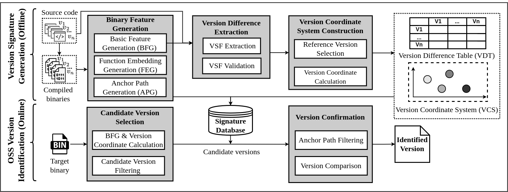

# LibvDiff Artifact

LibvDiff is a precise and efficient open-source software (OSS) version identification tool. It is designed to identify OSS versions in a fine-grained level, even though no version strings are available in the target binary. Here is the artifact related to LibvDiff, including the code and the dataset.


# Provenance

The artifact consists of two main parts: code and dataset

- [code](https://archive.softwareheritage.org/browse/origin/directory/?origin_url=https://github.com/GentleCP/LibvDiff-public): it includes all the code related to the reproduction of LibvDiff as well as our experiments, more details about how LibvDiff works is available from **Sec 3 to 5** in our paper.
- [dataset](https://zenodo.org/records/10390664)
  - dataset_features_example (For quick start only): it includes features that we have already generated and can be evaluated quickly.
  - OSS_version_dataset (Raw binary dataset): it includes the binary dataset mentioned in our paper, including **9** OSS, **168** versions and **2688** binaries, more details is available at **Sec 6** in our paper. 

# Data

Our dataset is mainly composed of binaries. We first clone code of 9 popular OSS from Github and their official website, and then compiled the source code into binaries using different compilation options, including 4 architectures (ARM, X86, X64, PPC) and 4 optimization levels
(O0, O1, O2, O3) with GCC v9.4.0. In total, we obtained 168 distinct versions of all OSS, resulting in 2688 (168 * 16) binaries as shown in Table 1 in our paper.
The structure of data storage is as follows:

```text
- OSS   # e.g. freetype
   |-- Lib of OSS    # e.g. libfreetype
       |-- architecture   # e.g. ARM
           |-- optimization   # e.g. O0 
              |-- version   # e.g. VER-2-4-1
                  |-- binary   # e.g. freetype-2.4.0 
```

The total size of our dataset is 800.9MB (compressed). When the dataset (`OSS_version_dataset.tar.gz`) is downloaded, it should be extract under `data_process/` (i.e. `data_process/dataset`)

# Setup

We have provided a docker file to easily construct the image of running environment, as see in our source code. 
Before that, there are some hardware and software requirements should be satisfied.

- Hardware: A PC with at least 32GB memory and 200GB hard disk space. It would be better if GPU is available. Our experiments are tested on 
  a linux server (ubuntu18.04) with Intel Xeon 128-core 3.0GHz CPU, 1 TB memory, and 4 GeForce RTX 3090.
- Software: Our docker file will install the most necessary packages except for IDA Pro. Since IDA Pro is a commercial software, 
  we are afraid that we can not provide the software directly. It should be installed manually in the right place as described in `IDA Pro install`


At first, download the code and dataset of LibvDiff as described in `Provenance`.

## Running environment construction with docker file

Workon `LibvDiff-public` by `cd LibvDiff-public`. Please make sure `docker` is available, the docker version we used is `24.0.5`. And then construct the environment with the following code:

1. Build environment with docker file

```text
docker build -t libvdiff:1.0 .
```

2. Start docker container
   After that, you shall see docker image named `libvdiff` with `docker image list`, and then create a container with the image.

```shell
docker run -it --name libvdiff libvdiff:1.0 /bin/bash
```

3. Activate conda environment

```shell
conda activate libvdiff
```

## Running environment construction manually

If you can not construct the environment with docker file, you are also able to construct with the following commands.

1. Create a new container with ubuntu18.04 or a local PC with ubuntu18.04 
2. Install packages

```shell
apt install wget bzip2 git
```

3. Install conda

```shell
mkdir /root/miniconda3 && \
wget https://repo.anaconda.com/miniconda/Miniconda3-latest-Linux-x86_64.sh -O /root/miniconda3/miniconda.sh && \
bash /root/miniconda3/miniconda.sh -b -u -p /root/miniconda3 && \
rm -rf /root/miniconda3/miniconda.sh && \
/root/miniconda3/bin/conda init bash
```

> Make sure `conda` command is available

4. Create a python environment and activate it

```shell
conda create --name libvdiff python=3.8
conda activate libvdiff
```

5. Install python packages

```shell
conda install pytorch==1.12.1 torchvision==0.13.1 torchaudio==0.12.1 -c pytorch  # GPU (recommend)
pip install -r requirements.txt
```

## IDA Pro install

> Note: if you only want to have a quick start (go to Usage/Quick Start), there is no need to install IDA Pro in advance, it is only used when generating binary features

- IDA Pro 7.5+ on linux: 

  - Make sure the IDA Python switches to python3

  - Extra python packages are required to install for IDA Python: `PATH_TO_IDA_PYTHON -m pip install cptools==2.0.1 networkx==2.4"`

    >   The python version used in IDA is Python3.6, we recommend Python3.6 or Python3.8
    >   In linux, IDA often uses the system python interpreter as its python interpreter

  - The default IDA installation path is `/root/idapro-7.5`, if you change to another location, please update the `IDA_PATH` and `IDA64_PATH` in `data_process/settings.py`


# Usage

In this section, we first give a quick start to show how to run LibvDiff quickly with `Quick start example dataset` which has been downloaded. Additionally, we give more details about how does the whole process work. 


## Quick Start

To evaluate LibvDiff quickly, please download the `dataset_features_example.tar.gz` at first and extract it under `data_process` (i.e., `data_process/dataset`, `data_process/features`).

You are able to get help of LibvDiff as follows:

```shell
python libvdiff.py --help
usage: libvdiff.py [-h] [-o OSS] [-c] [-a] [-e EXP]

optional arguments:
  -h, --help         show this help message and exit
  -o OSS, --oss OSS  specify OSS to test
  -c, --cvf          Turn on cvf
  -a, --apf          Turn on apf
  -e EXP, --exp EXP  Experiment (co: cross optimization, ca: cross architecture, cb: cross both)
```

First, `libvdiff.py` load all necessary binaries with their features from local file as dataset according to the experiment, and prepare related features based on the input OSS. After that, for each binary in dataset, it identifies the OSS version that used in binary. If the identified version is same to the ground truth version, it will be counted as a true positive. 

> More details is available at **Sec 6.1** (Dataset and Experiment Settings) in our paper. 

That is it, you are ready to go with the following command:

```shell
python libvdiff.py -o freetype --cvf --apf -e co
```

> It provides the experiment on freetype cross-optimization (co) with cvf and apf enabled. 

- Output (with precision): 

```shell
load model from /root/largefiles/LibvDiff-public/saved/models/Asteria/crossarch_train_100000_1659022264.018625.pt, device is cuda:0
oss:freetype, lib: libfreetype, cvf: True, apf: True, exp:cross_optim
identify VER-2-8-1-ARM-O0 is VER-2-8-1-ARM-O1, 0.850: 100%|███████████████████████████████████████████████████████████████████████████████████| 20/20 [00:00<00:00, 21.88it/s]
identify VER-2-8-1-ARM-O0 is VER-2-8-1-ARM-O2, 0.850: 100%|███████████████████████████████████████████████████████████████████████████████████| 20/20 [00:01<00:00, 11.17it/s]
identify VER-2-8-1-ARM-O0 is VER-2-8-1-ARM-O3, 0.817: 100%|███████████████████████████████████████████████████████████████████████████████████| 20/20 [00:01<00:00, 19.59it/s]
identify VER-2-8-1-ARM-O1 is VER-2-8-1-ARM-O0, 0.825: 100%|███████████████████████████████████████████████████████████████████████████████████| 20/20 [00:01<00:00, 11.93it/s]
identify VER-2-8-1-ARM-O1 is VER-2-8-1-ARM-O2, 0.840: 100%|███████████████████████████████████████████████████████████████████████████████████| 20/20 [00:01<00:00, 13.00it/s]
identify VER-2-8-1-ARM-O1 is VER-2-8-1-ARM-O3, 0.825: 100%|███████████████████████████████████████████████████████████████████████████████████| 20/20 [00:01<00:00, 14.27it/s]
identify VER-2-8-1-ARM-O2 is VER-2-8-1-ARM-O0, 0.814: 100%|███████████████████████████████████████████████████████████████████████████████████| 20/20 [00:01<00:00, 11.32it/s]
identify VER-2-8-1-ARM-O2 is VER-2-8-1-ARM-O1, 0.825: 100%|███████████████████████████████████████████████████████████████████████████████████| 20/20 [00:01<00:00, 19.50it/s]
identify VER-2-8-1-ARM-O2 is VER-2-8-1-ARM-O3, 0.833: 100%|███████████████████████████████████████████████████████████████████████████████████| 20/20 [00:01<00:00, 19.04it/s]
identify VER-2-8-1-ARM-O3 is VER-2-8-1-ARM-O0, 0.830: 100%|███████████████████████████████████████████████████████████████████████████████████| 20/20 [00:01<00:00, 11.21it/s]
identify VER-2-8-1-ARM-O3 is VER-2-8-1-ARM-O1, 0.823: 100%|███████████████████████████████████████████████████████████████████████████████████| 20/20 [00:01<00:00, 12.96it/s]
identify VER-2-8-1-ARM-O3 is VER-2-8-1-ARM-O2, 0.825: 100%|███████████████████████████████████████████████████████████████████████████████████| 20/20 [00:01<00:00, 14.33it/s]
finished
```

You can get different experiment results by providing different arguments!

## Usage in detail
The workflow of LibvDiff is as follows:


1. Version Signature Generation: It generates all the features based on the source code and compiled binaries of OSS as signatures. There are three main stages: **Binary Feature Generation**, **Version Difference Extraction** and **Version Coordinate System Construction**.
> !!! It should be noted that you have to change the root directory to `data_process` with command `cd data_process` when generating version signatures

2. OSS Version Identification: It identifies the OSS version used in the target binary with pre-generated signatures. There are two main stages: **Candidate Version Selection** and **Version Confirmation**.

We shall discuss how these stages are implemented in the following sections.

> It should be noted that we pre generated all features of binaries for experiment purpose. In fact, not all of them are needed to be generated based on our two designed filters. 

### Binary Feature Generation
>  The process of how these features are generated is available at **Sec 4.1** in our paper. 

There are three types of binary features used in LibvDiff:

- basic features: function names (including exports), string literals
- function embeddings
- anchor paths

Two main python scripts are used to generate binary features.

```shell
python feature_generator.py -o freetype  
python feat_encoding.py -o freetype
```
- `feature_generator.py` generates all the necessary binary features of input OSS 
- `feat_encoding.py` generates the function embeddings of binary functions based on Asteria

### Version Difference Extraction
>  The process of how version differences are extracted is available at **Sec 4.2** in our paper. 

Before generating version differences, you have to clone the source code of OSS into `data_process/features/OSS-code`. Take freetype as an example,

```shell
git clone https://gitlab.freedesktop.org/freetype/freetype.git data_process/features/freetype/freetype-code
```

Then generate the version differences with `vdcs_generator.py` 
- `vdcs_generator.py` generate the version differences of input OSS.

> before running the example, please make sure the source code of OSS and compiled binaries are in the right place. 

You are able to clone all repositories of OSS by running the following commands:

```shell
git clone https://gitlab.freedesktop.org/freetype/freetype.git data_process/features/freetype/freetype-code
git clone https://github.com/openssl/openssl.git data_process/features/openssl/openssl-code
git clone https://gitlab.gnome.org/GNOME/libxml2.git data_process/features/libxml2/libxml2-code
git clone https://github.com/awslabs/aws-c-common.git data_process/features/aws-c-common/aws-c-common-code
git clone https://github.com/Blosc/c-blosc.git data_process/features/c-blosc/c-blosc-code
git clone https://github.com/libexpat/libexpat.git data_process/features/expat/expat-code
git clone https://github.com/Mbed-TLS/mbedtls.git data_process/features/mbedtls/mbedtls-code
git clone https://github.com/madler/zlib.git data_process/features/zlib/zlib-code
git clone https://github.com/glennrp/libpng.git data_process/features/libpng/libpng-code
```

```shell
python vdcs_generator.py -o freetype
```

### Version Coordinate System Construction

>  The process of how version coordinates are calculated is available at **Sec 4.3** in our paper. 

Version coordinates are generated with `vct_generator.py`, you have to generate version differences and basic features at first before generate version coordinates.

```shell
python vct_generator.py -o freetype
```
- `vct_generator.py` generates the version coordinates of each version of input OSS

### Candidate Version Selection & Version Confirmation

> The process of version identification is available at **Sec 5** in our paper. 

After feature generation, you are able to test other OSS like freetype. See Section `Quick Start`

The main entry of version identification is `libvdiff.py`, it first selects the candidate versions of input binary with specific OSS, and then identifies the OSS version. 


# Citation

If the code and dataset of LibvDiff are helpful for your research, please consider citing the following BibTex entry:

```
@INPROCEEDINGS {,
author = {C. Dong and S. Li and S. Yang and Y. Xiao and Y. Wang and H. Li and Z. Li and L. Sun},
booktitle = {2024 IEEE/ACM 46th International Conference on Software Engineering (ICSE)},
title = {LibvDiff: Library Version Difference Guided OSS Version Identification in Binaries},
year = {2024},
volume = {},
issn = {1558-1225},
pages = {780-791},
abstract = {Open-source software (OSS) has been extensively employed to expedite software development, inevitably exposing downstream software to the peril of potential vulnerabilities. Precisely identifying the version of OSS not only facilitates the detection of vulnerabilities associated with it but also enables timely alerts upon the release of 1-day vulnerabilities. However, current methods for identifying OSS versions rely heavily on version strings or constant features, which may not be present in compiled OSS binaries or may not be representative when only function code changes are made. As a result, these methods are often imprecise in identifying the version of OSS binaries being used. To this end, we propose LibvDiff, a novel approach for identifying open-source software versions. It detects subtle differences through precise symbol information and function-level code changes using binary code similarity detection. LibvDiff introduces a candidate version filter based on a novel version coordinate system to improve efficiency by quantifying gaps between versions and rapidly identifying potential versions. To speed up the code similarity detection process, LibvDiff proposes a function call-based anchor path filter to minimize the number of functions compared in the target binary. We evaluate the performance of LibvDiff through comprehensive experiments under various compilation settings and two datasets (one with version strings, and the other without version strings), which demonstrate that our approach achieves 94.5% and 78.7% precision in two datasets, outperforming state-of-the-art works (including both academic methods and industry tools) by an average of 54.2% and 160.3%, respectively. By identifying and analyzing OSS binaries in real-world firmware images, we make several interesting findings, such as developers having significant differences in their updates to different OSS, and different vendors may also utilize identical OSS binaries.},
keywords = {open-source software;version identification;vulnerability detection;firmware analysis},
doi = {},
url = {https://doi.ieeecomputersociety.org/},
publisher = {IEEE Computer Society},
address = {Los Alamitos, CA, USA},
month = {apr}
}

```

